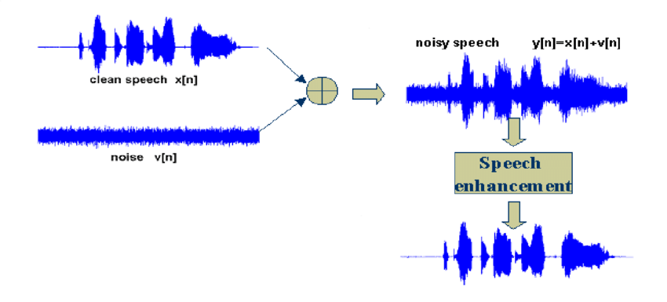

# Speech Enhancement Research

Speech enhancement is the process of improving the quality and intelligibility of speech signals by reducing noise, reverberation, and other distortions. It plays a crucial role in real-world applications such as telecommunication, hearing aids, automatic speech recognition (ASR), and human-computer interaction. By leveraging signal processing techniques and deep learning models, speech enhancement systems aim to provide clearer and more natural-sounding audio for both human listeners and machine listeners.
  
- For my research findings, please refer to the "Publications" folder.
- The code of [Conformer-based metric GAN method](./CMGAN).  
- The code of [DEMUCS method](./Denoiser).  